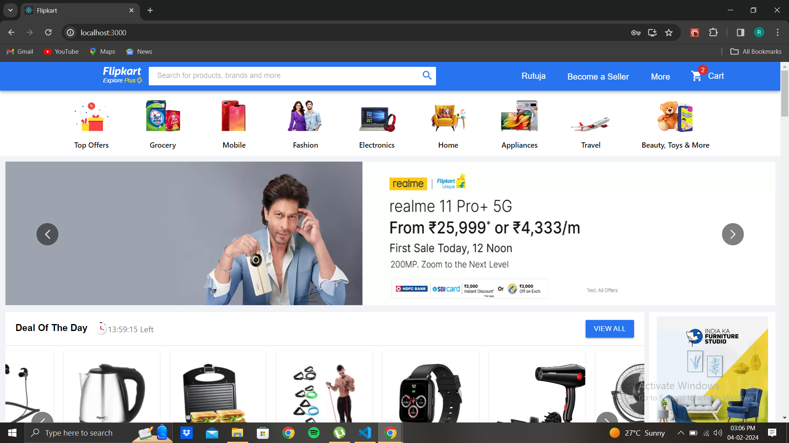
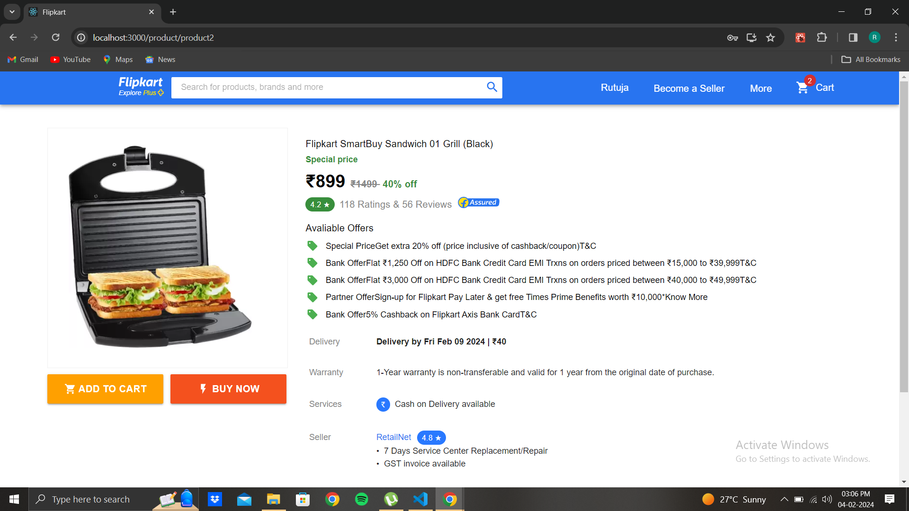
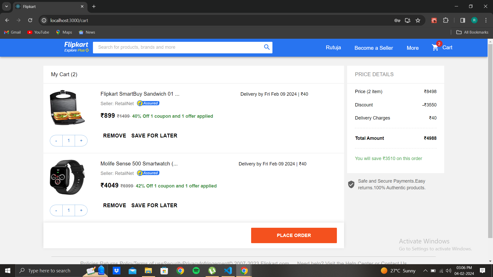

# Flipkart Clone

A comprehensive e-commerce web application that replicates the functionality and design of the popular platform Flipkart. This project is built using the MERN stack (MongoDB, Express.js, React.js, Node.js) for the backend and frontend, along with other technologies to enhance the user experience.





## Table of Contents

- [About the Project](#about-the-project)
- [Features](#features)
- [Tech Stack](#tech-stack)
- [Getting Started](#getting-started)
  - [Prerequisites](#prerequisites)
  - [Installation](#installation)
- [Usage](#usage)
- [Project Structure](#project-structure)
- [Contributing](#contributing)


## About the Project

The Flipkart Clone project is a feature-rich e-commerce platform designed to provide users with a seamless shopping experience. It encompasses user authentication, product listings, shopping cart functionality, and search capabilities.

## Features

- **User Authentication:**
  - Sign up, log in, and manage user accounts securely.
- **Product Listings:**
  - Browse through an extensive range of products with detailed descriptions.
- **Shopping Cart:**
  - Add and remove items from the cart, view total prices.
- **Search Functionality:**
  - Quickly find products based on keywords with an efficient search feature.

## Tech Stack

- **Frontend:**
  - React.js with functional components and hooks.
  - Redux for state management.
  - Material-UI for UI components.
- **Backend:**
  - Node.js with Express.js for the server.
  - MongoDB as the database using Mongoose for ODM.

- **Other Tools:**
  - Axios for HTTP requests.
  - Postman for API development

## Getting Started

### Prerequisites

Make sure you have the following software/tools installed:

- Node.js and npm (Node Package Manager).
- MongoDB (Make sure it's running locally or provide a remote connection URL).

### Installation

1. **Clone the repository:**

   ```bash
   git clone https://github.com/<username>/flipkartclone.git

2. Navigate to the project directory:
   cd flipkartclone

3. Install dependencies:
   npm install

### Installation
1. Run the application:
   npm start

2. The app will be accessible at 'http://localhost:3000'.

### Project Structure
/client:
Contains the React.js frontend code.
/server:
Houses the Node.js backend code.
/screenshots:
Includes screenshots of the project.

### Contributing
Contributions are welcome! Follow these steps to contribute:

Fork the repository.
Create a new branch: git checkout -b feature/new-feature.
Make your changes and commit them: git commit -m 'Add new feature'.
Push to the branch: git push origin feature/new-feature.
Submit a pull request.
   
